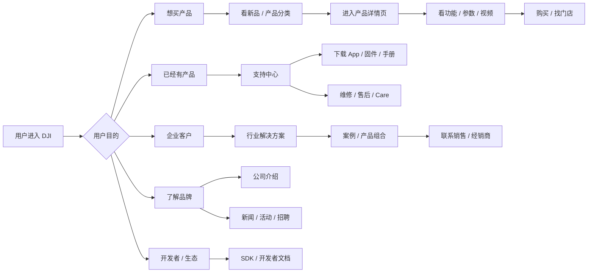
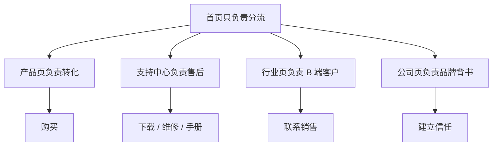
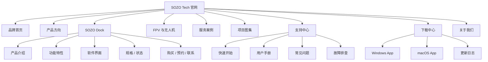

```mermaid
flowchart TD
    A["DJI.com 主站"] --> B["首页 Home"]
    A --> C["产品矩阵 Products"]
    A --> D["产品详情页 Product Pages"]
    A --> E["购买转化 Store / Where to Buy"]
    A --> F["支持中心 Support"]
    A --> G["行业解决方案 Enterprise / Agriculture"]
    A --> H["品牌与公司 Company"]
    A --> I["内容与社区 News / Forum / Skypixel"]
    A --> J["开发者 Developer"]

    B --> B1["新品首屏"]
    B --> B2["热门产品入口"]
    B --> B3["不同领域入口"]
    B --> B4["支持 / 购买 / 飞行安全入口"]

    C --> C1["消费级无人机"]
    C --> C2["影像设备"]
    C --> C3["手持稳定器"]
    C --> C4["行业无人机"]
    C --> C5["农业无人机"]
    C --> C6["配件 / 软件"]

    D --> D1["产品营销页"]
    D --> D2["功能特性"]
    D --> D3["影像 / 视频展示"]
    D --> D4["规格参数"]
    D --> D5["购买按钮"]
    D --> D6["下载 / 手册 / 支持入口"]

    F --> F1["产品支持"]
    F --> F2["下载中心"]
    F --> F3["App / 软件"]
    F --> F4["说明书 / 用户手册"]
    F --> F5["维修服务"]
    F --> F6["售后政策"]
    F --> F7["DJI Care 服务计划"]

    G --> G1["行业首页"]
    G --> G2["公共安全"]
    G --> G3["测绘"]
    G --> G4["巡检"]
    G --> G5["农业"]
    G --> G6["案例研究"]
    G --> G7["联系销售 / 找经销商"]

    H --> H1["公司介绍"]
    H --> H2["新闻活动"]
    H --> H3["招聘"]
    H --> H4["联系方式"]

    I --> I1["新闻"]
    I --> I2["活动"]
    I --> I3["社区"]
    I --> I4["作品展示"]

    J --> J1["SDK"]
    J --> J2["开发文档"]
    J --> J3["开发者生态"]
```

如果拆成“用户路径”，它大概是这样：

```mermaid
flowchart LR
    A["用户进入 DJI"] --> B{"用户目的"}

    B --> C["想买产品"]
    C --> C1["看新品 / 产品分类"]
    C1 --> C2["进入产品详情页"]
    C2 --> C3["看功能 / 参数 / 视频"]
    C3 --> C4["购买 / 找门店"]

    B --> D["已经有产品"]
    D --> D1["支持中心"]
    D1 --> D2["下载 App / 固件 / 手册"]
    D1 --> D3["维修 / 售后 / Care"]

    B --> E["企业客户"]
    E --> E1["行业解决方案"]
    E1 --> E2["案例 / 产品组合"]
    E2 --> E3["联系销售 / 经销商"]

    B --> F["了解品牌"]
    F --> F1["公司介绍"]
    F --> F2["新闻 / 活动 / 招聘"]

    B --> G["开发者 / 生态"]
    G --> G1["SDK / 开发者文档"]
```

它的核心逻辑不是把所有内容堆在首页，而是：

```mermaid
flowchart TD
    A["首页只负责分流"] --> B["产品页负责转化"]
    A --> C["支持中心负责售后"]
    A --> D["行业页负责 B 端客户"]
    A --> E["公司页负责品牌背书"]

    B --> F["购买"]
    C --> G["下载 / 维修 / 手册"]
    D --> H["联系销售"]
    E --> I["建立信任"]
```

对我们 SOZO-web 来说，不需要一开始做得像 DJI 那么大，但可以学习它的结构思想：

```mermaid
flowchart TD
    A["SOZO Tech 官网"] --> B["品牌首页"]
    A --> C["产品方向"]
    A --> D["SOZO Dock"]
    A --> E["FPV 与无人机"]
    A --> F["服务案例"]
    A --> G["项目图集"]
    A --> H["支持中心"]
    A --> I["下载中心"]
    A --> J["关于我们"]

    D --> D1["产品介绍"]
    D --> D2["功能特性"]
    D --> D3["软件界面"]
    D --> D4["规格 / 状态"]
    D --> D5["购买 / 预约 / 联系"]

    H --> H1["快速开始"]
    H --> H2["用户手册"]
    H --> H3["常见问题"]
    H --> H4["故障排查"]

    I --> I1["Windows App"]
    I --> I2["macOS App"]
    I --> I3["更新日志"]
```
