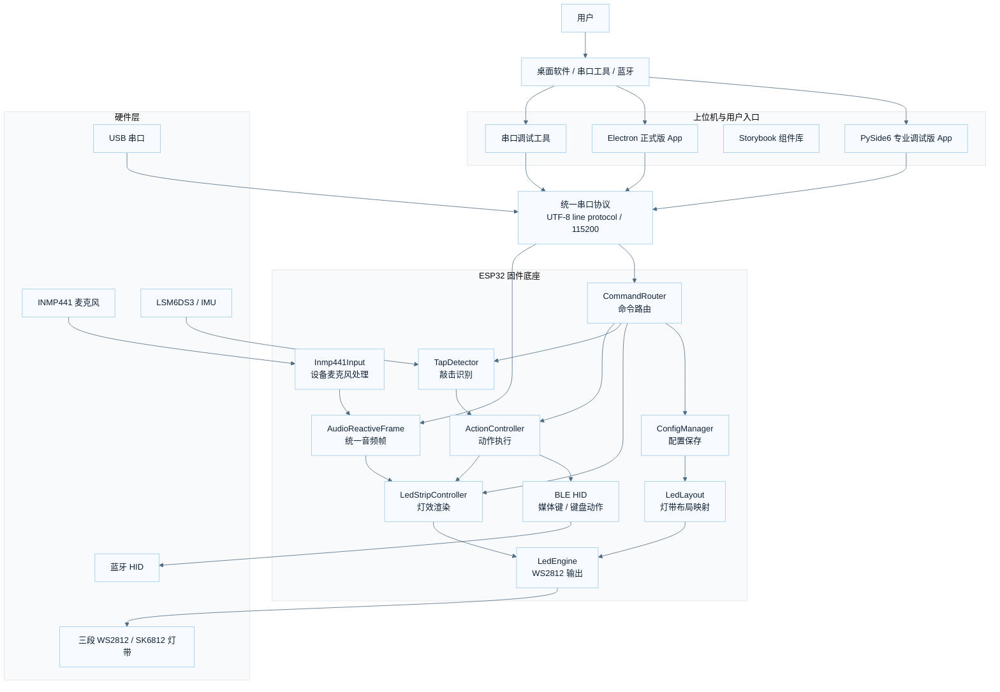
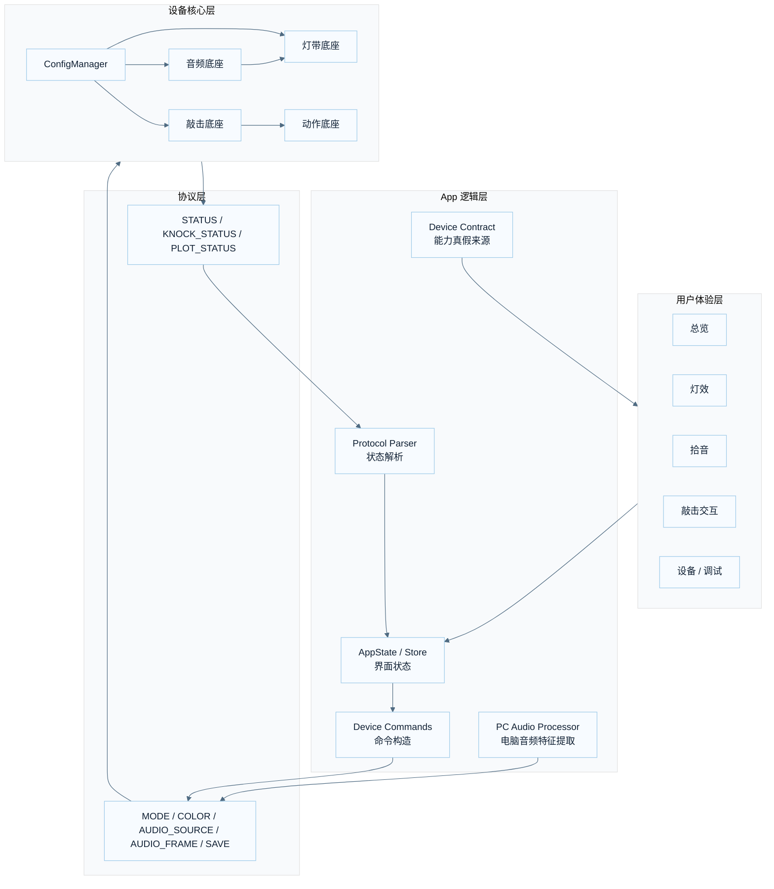
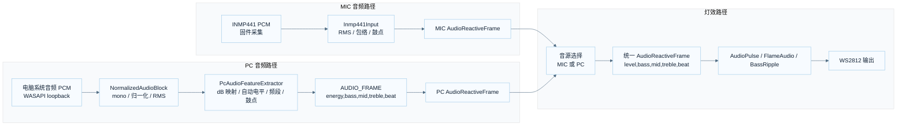
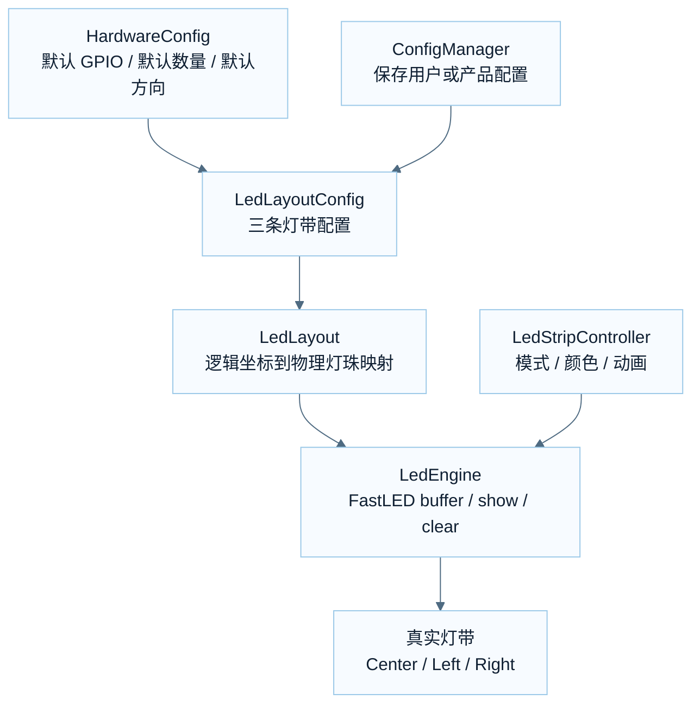
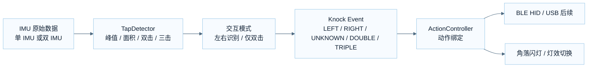
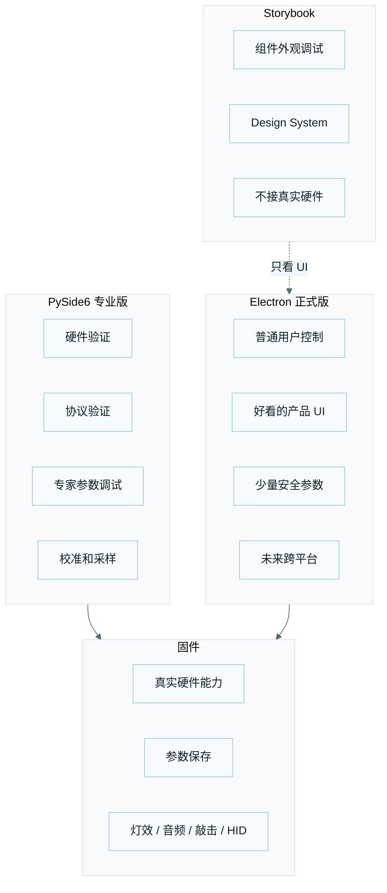

# SOZO Dock 系统拓扑图

本文档用来解释 SOZO Dock 从用户操作到硬件执行的整体运行逻辑。  
图使用 Mermaid 编写，GitHub 可以直接渲染；本地 VS Code 如果想预览，可以安装 Mermaid Preview 类插件。

## 1. 总体系统拓扑

SOZO Dock 的核心不是某一个 App，也不是某一个灯效，而是一套“硬件能力 + 固件服务 + 协议 + App 体验”的系统。



## 2. 产品分层逻辑

后续开发时，优先看这张图判断“这次改动应该落在哪一层”。



### 分层原则

- UI 只负责展示和交互，不直接拼底层串口命令。
- 命令统一从 `device_commands.py` 或后续 Electron 的 command builder 出。
- 固件参数以 `ConfigManager` 为保存中心。
- 灯效层只消费统一音频帧，不直接关心 MIC / PC 来源。
- 敲击识别只输出事件，动作执行由动作层负责。

## 3. 音频链路拓扑

这是当前最容易混乱的一条链路。原则是：MIC 和 PC 可以在前面各自处理，但最后必须统一成 `AudioReactiveFrame`。



### 音频链路规则

- PC 模式下，不叠加 MIC。
- MIC 模式下，不读取 PC 音频帧。
- PC 音频调参只改 App 端 `PcAudioFeatureExtractor`。
- MIC 音频调参只改固件端 `Inmp441Input`。
- 灯效调参只改灯效渲染，不拿灯效参数补偿音源差异。

## 4. 灯带系统拓扑

灯带系统分为“物理布局”和“灯效渲染”两件事。灯效不应该自己处理每条灯带的方向和数量。



### 灯带规则

- 产品默认数量写在 `HardwareConfig`。
- 可变产品配置由 `ConfigManager` 保存。
- `LedLayout` 负责方向、数量、逻辑坐标。
- `LedEngine` 负责真实 WS2812 输出。
- 灯效只用逻辑接口，不直接关心某条灯带是否反向。

## 5. 敲击交互拓扑

敲击系统分三层：传感器、识别、动作。不要把动作逻辑塞进传感器读取里。



### 敲击规则

- 单 IMU 是 V1 小批量的优先硬件策略。
- 双 IMU 可以提供左右识别，但用户仍应能关闭左右识别，改用“仅双击”。
- 调试参数可以保留在 PySide6 专业版。
- 正式用户界面优先给“低 / 默认 / 高”三档灵敏度，不暴露大量专家参数。

## 6. App 角色边界



### App 规则

- PySide6 是专业工具，不等于最终消费级 App。
- Electron 是未来正式 App，但必须按 `device_contract_v1.json` 做真实能力判断。
- Storybook 只调 UI，不连接串口、不接音频、不碰固件。
- 如果某个功能固件不支持，App 不应该做成可点击的真实按钮。

## 7. 当前不属于产品运行链路的东西

这些文件或目录目前属于研发辅助，不是产品底座：

```text
captures/
tools/analyze_led_video.py
tools/capture_audio_compare.py
tools/capture_pc_audio_profile.py
```

用途：

- 对比 MIC / PC 音频采样。
- 分析灯带视频变化。
- 辅助调参。

发布产品或打包 App 时，不应该把采样数据一起带进去。

## 8. 后续开发时怎么用这张图

新增功能前先判断它属于哪一层：

```text
改 UI 观感        → App / Storybook / Design System
改参数同步        → Protocol / Device Commands / ConfigManager
改音频灵动感      → MIC Processor 或 PC Audio Processor
改灯效好不好看    → LedStripController 或后续 Effect 模块
改灯带数量方向    → HardwareConfig / ConfigManager / LedLayout
改敲击准确率      → TapDetector
改双击触发动作    → ActionController
```

如果一次改动跨了三层以上，默认应该拆小步做。
